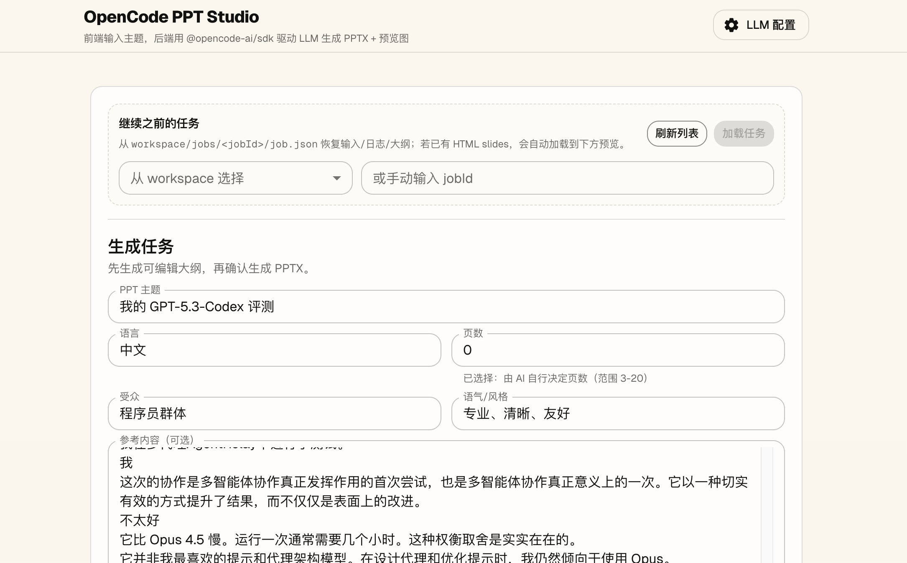
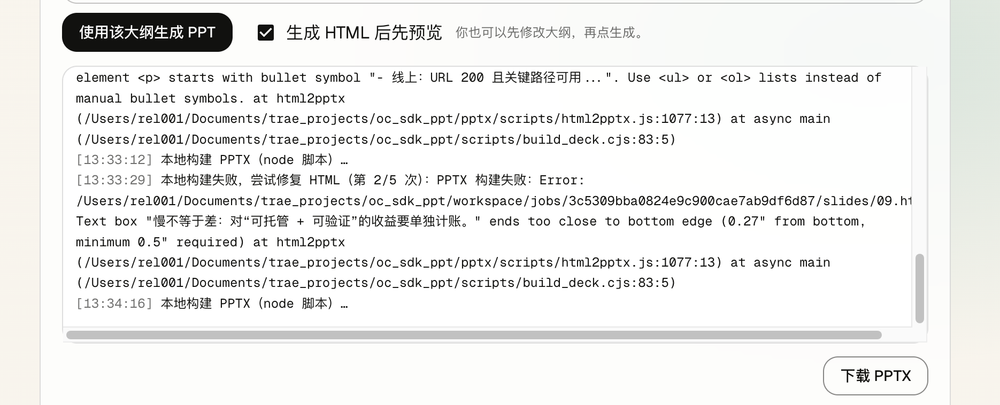
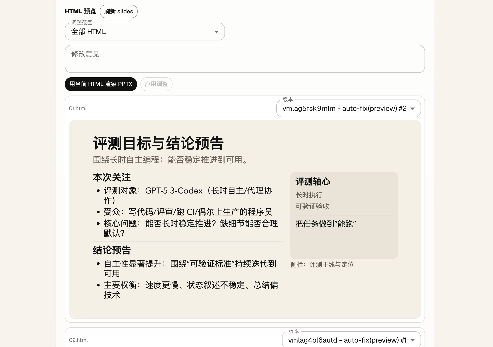

# OpenCode PPT Studio

一个 PPT 生成 Agent：在网页填写主题与约束，后端用 `@opencode-ai/sdk` 驱动 LLM 先产出可编辑大纲，再生成 HTML slides，最后本地构建 `deck.pptx`。

## 项目截图







## 功能与特点

- 大纲优先：`生成大纲 -> 人工可编辑 -> 确认生成`，避免一上来就“黑盒出 PPT”。
- 双模式生成：
  - `preview`：只生成 HTML slides，直接在页面 iframe 预览
  - `pptx`：基于 HTML slides 本地构建 PPTX
- 自动校验与自修复：生成 HTML 后会用 Playwright 做尺寸/溢出校验；失败则在同一个 session 内多轮让 LLM 修复 HTML，再重试本地构建。
- HTML 调整回路：用户输入“修改意见”，后端直接修改已生成的 HTML slides，并为变更创建版本快照。
- Slide 版本管理：每个 `01.html/02.html/...` 都有版本历史，可在页面切换“当前激活版本”。
- 任务可恢复：任务状态持久化到 `workspace/jobs/<jobId>/job.json`，页面可从 jobId 恢复输入/日志/大纲，并继续调整/渲染。
- 可嵌入或连接 opencode server：
  - 默认自动启动内嵌 opencode server（带 Basic Auth 密码）
  - 或使用 `OPENCODE_BASE_URL` 连接外部 opencode server
- Web 端可配置 provider/model：通过 UI 读写 `opencode.json`（apiKey 不回显），并一键重载内嵌 opencode server。

## 快速开始

前置：

- Node.js 20+（推荐）
- Playwright 运行环境
  - macOS：建议安装 Google Chrome（转换脚本会优先用 `chrome` channel）
  - 或者执行 `npx playwright install` 安装 Playwright 自带浏览器（适用于 `playwright-core` 场景）

启动：

```bash
npm install
npm run dev
```

打开 http://localhost:3000

构建：

```bash
npm run build
npm run start
```

生成产物默认写到：`workspace/jobs/<jobId>/`

## 首次部署：提供 opencode.json（模型列表来源）

项目的模型下拉框来自 `opencode.json`（接口：`GET /api/opencode/models`）。但 `opencode.json` 默认在 `.gitignore` 中，通常不会随代码仓库一起提交，所以首次部署/首次启动时需要你显式提供它。

方式 A：文件复制/注入（推荐用于部署环境）

```bash
cp opencode.example.json opencode.json
```

然后把每个 provider 的 `options.apiKey` 填好（建议通过部署系统的 Secret/Config 注入，而不是写死到镜像/仓库）。

方式 B：用页面右上角的“LLM 配置”写入

- 页面会通过 `POST /api/opencode/config` 写入 `opencode.json`（apiKey 不回显，留空表示保留旧值）
- 写入后会调用 `POST /api/opencode/reload` 重载内嵌 opencode server，使配置立即生效

提示：如果启动后模型下拉框显示“暂无模型”，基本就是 `opencode.json` 不存在/不可读，或其中没有配置任何 models。

## 目录结构（核心）

- `src/app`：Next.js App Router UI
- `src/app/api`：API Routes（PPT jobs + opencode config）
- `src/lib/runJob.ts`：任务执行主流程（outline / html / validate&fix / build pptx / adjust / render）
- `scripts/build_deck.cjs`：把 `workspace/.../slides/*.html` 转成 `deck.pptx`（pptxgenjs + `pptx/scripts/html2pptx.js`）
- `scripts/validate_slides.mjs`：用 Playwright 校验 HTML body 尺寸与 overflow
- `workspace/`：任务持久化与产物目录（已加入 `.gitignore`）
- `pptx/`：html2pptx 工具与 OOXML 辅助脚本/文档

## 工作流（端到端）

1) `POST /api/ppt/jobs` 创建任务，后台启动 `runOutlineJob()`：
   - 创建 opencode session
   - 生成并落盘 `workspace/jobs/<jobId>/outline.md`
   - 状态进入 `awaiting_approval`，前端可编辑大纲

2) `POST /api/ppt/jobs/<jobId>/approve` 确认生成：
   - 可携带编辑后的 `outlineMarkdown` 覆盖落盘
   - 以新 session 生成 HTML slides（`workspace/jobs/<jobId>/slides/01.html ...`）
   - `preview` 模式：只生成并校验 HTML，页面预览 + 允许继续调整
   - `pptx` 模式：校验 HTML 后本地构建 `deck.pptx`（失败会触发 LLM 修复重试）

3) 调整与版本：
   - `POST /api/ppt/jobs/<jobId>/slides/adjust`：按意见修改 HTML（全部或指定某一页），并对变更页创建版本快照
   - `POST /api/ppt/jobs/<jobId>/slides/activate`：切换某页的激活版本（会让已有 PPTX 失效，需要重新渲染）
   - `POST /api/ppt/jobs/<jobId>/render`：用当前 HTML slides 重新渲染 PPTX

## API（主要）

PPT Jobs：

- `GET /api/ppt/jobs`：列出本地 `workspace/jobs` 的任务摘要
- `POST /api/ppt/jobs`：创建任务（后台生成大纲） -> `{ jobId }`
- `GET /api/ppt/jobs/<jobId>`：获取任务状态/日志/下载链接
- `GET /api/ppt/jobs/<jobId>/events`：SSE 推进度（log/status/outline/result）
- `POST /api/ppt/jobs/<jobId>/approve`：确认大纲并开始生成（`buildMode=preview|pptx`）
- `GET /api/ppt/jobs/<jobId>/slides`：列出 HTML slides 与版本元信息
- `POST /api/ppt/jobs/<jobId>/slides/adjust`：按意见修改 HTML slides
- `POST /api/ppt/jobs/<jobId>/slides/activate`：切换某页激活版本
- `POST /api/ppt/jobs/<jobId>/render`：从当前 HTML slides 构建 PPTX
- `GET /api/ppt/jobs/<jobId>/pptx`：下载 `deck.pptx`
- `GET /api/ppt/jobs/<jobId>/files/<path...>`：读取 `workspace/jobs/<jobId>/...` 下的静态文件（用于 iframe 预览）

LLM / opencode：

- `GET /api/opencode/models`：读取 `opencode.json` 中配置的 `provider/model` 列表
- `GET /api/opencode/config`：读取 `opencode.json`（apiKey 脱敏）
- `POST /api/opencode/config`：写入 `opencode.json`（支持 upsert/delete provider；会生成 `.bak`）
- `POST /api/opencode/reload`：重载内嵌 opencode server（连接远端时会拒绝）

## 环境变量（可选）

连接远端 opencode server：

- `OPENCODE_BASE_URL=http://localhost:5937`

内嵌 opencode server（默认 hostname=127.0.0.1, port=5937；端口占用会递增重试）：

- `OPENCODE_HOSTNAME=127.0.0.1`
- `OPENCODE_PORT=5937`
- `OPENCODE_PORT_MAX_TRIES=20`
- `OPENCODE_START_TIMEOUT_MS=15000`

Basic Auth（内嵌 server 默认会设置密码；用户名固定为 `opencode`）：

- `OPENCODE_SERVER_PASSWORD=oc-ppt-agent`

强制指定模型（不通过 UI 选择时可用）：

- `OPENCODE_MODEL_PROVIDER=anthropic`
- `OPENCODE_MODEL_ID=claude-3-5-sonnet-20241022`

## 注意事项 / 限制

- 这是“单机/本地”范式：任务在同一 Next 进程内后台执行，并写入本地 `workspace/`；不适合直接部署到无状态 serverless。
- `opencode.json` 通常包含 API key，已加入 `.gitignore`，建议只在本地维护。
